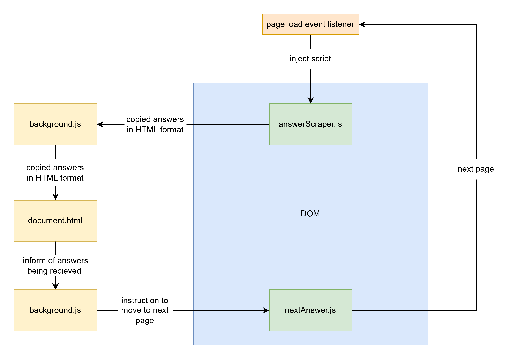

<p align="center">
  
</p>

# QUIZLET-DL
Download Quizlet textbook solutions as a PDF.

## Features
* Ability to download solutions without restrictions.
* $\LaTeX$ rendering when possible using [Katex](https://github.com/KaTeX/KaTeX).
* Markdown rendering using [markdown-it](https://github.com/waylonflinn/markdown-it-katex).
* Ability to add delays when scraping solutions (useful for slower connections).

## Demonstrations
Removed

## Extension Workflow
<p align="center">
  
</p>

n.b. this extension requires you to actively have Quizlet open in a browser window, as it directly manipulates the DOM.

## Making Changes
This extension is written in typescript and is compiled to JS when run. Compilation is done by:

```bash
tsc src
```

This extension uses [roll-up](https://www.extend-chrome.dev/rollup-plugin), to allow for importing / exporting functions in the content scripts. The usable code is found in [dist](dist/), and can be compiled via:

```bash
npm run build
```
